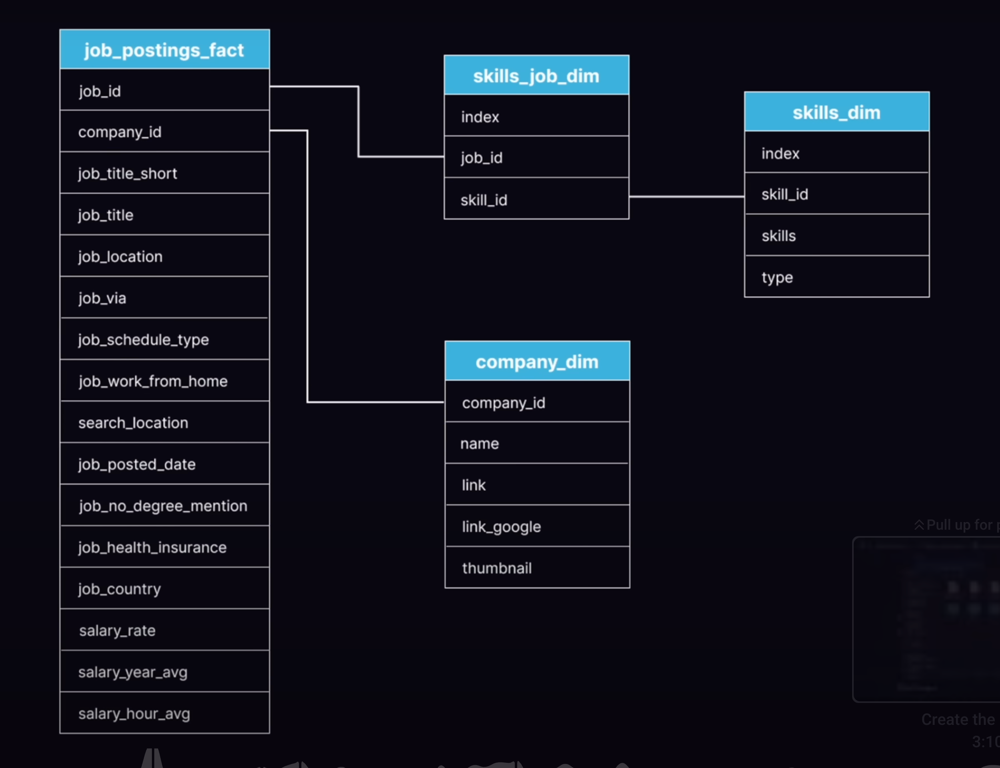

# Introduction
🔥 Dive into the data job market! Focusing on data analyst roles, this project explores top-paying jobs, in-demand skills, and where high demand meets high salary in data analytics. 📊

# Background
### 💭 The questions I wanted to answer through my SQL queries were:

1. What are the top-paying data analyst jobs? 
2. What skills are required for these top-paying
jobs?
3. What skills are most in demand for data
analysts?
4. Which skills are associated with higher
salaries?
5. What are the most optimal skills to learn?

### 📊 Database Tables


# Tools I Used
For my deep dive into the data analyst job market, I harnessed the power of several key tools:

- **SQL:** The backbone of my analysis, allowing me to
query the database and unearth critical insights.
- **PostgreSQL:** The chosen database management system, ideal for handling the job posting data.
- **Visual Studio Code:** My go-to for database management and executing SQL queries.
- **Git & GitHub:** Essential for version control and sharing my SQL scripts and analysis, ensuring collaboration and project tracking.

# The Analysis
🔎 Each query for this project aimed at investigating specific aspects of the data analyst job market.

### 1. What are the top-paying data analyst jobs?
<u>Code:<u>

```sql
SELECT 
    job_id,
    job_title,
    company_dim.name AS company_name,
    job_location,
    job_schedule_type,
    salary_year_avg,
    job_posted_date
    
FROM
    job_postings_fact

 -- only want rows whose companies have job postings
LEFT JOIN company_dim ON job_postings_fact.company_id = company_dim.company_id

WHERE
    salary_year_avg IS NOT NULL
    AND job_title_short = 'Data Analyst'
    AND job_location = 'Anywhere'

ORDER BY 
    salary_year_avg DESC

LIMIT 10
```
<u>Output:<u>

| job_id   | job_title                                         | company_name                                   | job_location | job_schedule_type | salary_year_avg | job_posted_date       |
|----------|---------------------------------------------------|------------------------------------------------|--------------|-------------------|-----------------|-----------------------|
| 226942   | Data Analyst                                       | Mantys                                         | Anywhere     | Full-time         | 650000.0        | 2023-02-20 15:13:33   |
| 547382   | Director of Analytics                              | Meta                                           | Anywhere     | Full-time         | 336500.0        | 2023-08-23 12:04:42   |
| 552322   | Associate Director- Data Insights                  | AT&T                                           | Anywhere     | Full-time         | 255829.5        | 2023-06-18 16:03:12   |
| 99305    | Data Analyst, Marketing                            | Pinterest Job Advertisements                   | Anywhere     | Full-time         | 232423.0        | 2023-12-05 20:00:40   |
| 1021647  | Data Analyst (Hybrid/Remote)                       | Uclahealthcareers                               | Anywhere     | Full-time         | 217000.0        | 2023-01-17 00:17:23   |
| 168310   | Principal Data Analyst (Remote)                    | SmartAsset                                      | Anywhere     | Full-time         | 205000.0        | 2023-08-09 11:00:01   |
| 731368   | Director, Data Analyst - HYBRID                    | Inclusively                                     | Anywhere     | Full-time         | 189309.0        | 2023-12-07 15:00:13   |
| 310660   | Principal Data Analyst, AV Performance Analysis    | Motional                                        | Anywhere     | Full-time         | 189000.0        | 2023-01-05 00:00:25   |
| 1749593  | Principal Data Analyst                             | SmartAsset                                      | Anywhere     | Full-time         | 186000.0        | 2023-07-11 16:00:05   |
| 387860   | ERM Data Analyst                                   | Get It Recruit - Information Technology        | Anywhere     | Full-time         | 184000.0        | 2023-06-09 08:01:04   |


### 2. What skills are required for these top-paying jobs?

<u>Code:<u>

```sql
WITH top_paying_jobs_company AS(
    SELECT 
        job_id,
        job_title,
        company_dim.name AS company_name,
        salary_year_avg
    FROM
        job_postings_fact

    -- only want rows whose companies have job postings
    LEFT JOIN company_dim ON job_postings_fact.company_id = company_dim.company_id

    WHERE
        salary_year_avg IS NOT NULL
        AND job_title_short = 'Data Analyst'
        AND job_location = 'Anywhere'

    ORDER BY 
        salary_year_avg DESC

    LIMIT 10
)

SELECT 
    top_paying_jobs_company.*,
    skills_dim.skills
FROM top_paying_jobs_company
INNER JOIN skills_job_dim ON top_paying_jobs_company.job_id = skills_job_dim.job_id
INNER JOIN skills_dim ON skills_job_dim.skill_id = skills_dim.skill_id
ORDER BY salary_year_avg
```
<u>Output:<u>

| job_id   | job_title                                         | company_name                                   | salary_year_avg | skills                                                                                                                                                                       |
|----------|---------------------------------------------------|------------------------------------------------|-----------------|------------------------------------------------------------------------------------------------------------------------------------------------------------------------------|
| 387860   | ERM Data Analyst                                   | Get It Recruit - Information Technology        | 184000.0        | sql, r, python                                                                                                                                                               |
| 1749593  | Principal Data Analyst                             | SmartAsset                                      | 186000.0        | excel, numpy, pandas, snowflake, go, sql, python, gitlab, tableau                                                                                                            |
| 310660   | Principal Data Analyst, AV Performance Analysis    | Motional                                        | 189000.0        | python, confluence, jira, atlassian, bitbucket, git, r, sql                                                                                                                  |
| 731368   | Director, Data Analyst - HYBRID                    | Inclusively                                     | 189309.0        | jenkins, sql, python, azure, aws, oracle, snowflake, tableau, power bi, sap, bitbucket, atlassian, jira, confluence                                                          |
| 168310   | Principal Data Analyst (Remote)                    | SmartAsset                                      | 205000.0        | tableau, gitlab, sql, python, go, snowflake, pandas, numpy, excel                                                                                                            |
| 1021647  | Data Analyst (Hybrid/Remote)                       | Uclahealthcareers                               | 217000.0        | tableau, flow, oracle, crystal, sql                                                                                                                                          |
| 99305    | Data Analyst, Marketing                            | Pinterest Job Advertisements                   | 232423.0        | python, tableau, sql, hadoop, r                                                                                                                                              |
| 552322   | Associate Director- Data Insights                  | AT&T                                           | 255829.5        | powerpoint, tableau, excel, jupyter, pyspark, pandas, aws, sql, databricks, azure, r, python, power bi                                                                       |


### 3. What skills are most in demand for data analysts?
<u>Code:<u>

```sql
SELECT
    COUNT(job_postings_fact.job_id) AS job_count,
    skills
FROM job_postings_fact
INNER JOIN skills_job_dim ON job_postings_fact.job_id = skills_job_dim.job_id
INNER JOIN skills_dim ON skills_job_dim.skill_id = skills_dim.skill_id
WHERE job_title_short = 'Data Analyst'
GROUP BY skills 
ORDER BY job_count DESC
LIMIT 5
```
<u>Output:<u>

| job_count | skills   |
|-----------|----------|
| 92628     | sql      |
| 67031     | excel    |
| 57326     | python   |
| 46554     | tableau  |
| 39468     | power bi |

### 4. Which skills are associated with higher salaries?
<u>Code:<u>

```sql
SELECT
    skills,
    ROUND(AVG(salary_year_avg), 2) AS avg_salary
FROM job_postings_fact
INNER JOIN skills_job_dim ON job_postings_fact.job_id = skills_job_dim.job_id
INNER JOIN skills_dim ON skills_job_dim.skill_id = skills_dim.skill_id
WHERE 
    job_title_short = 'Data Analyst'
    AND salary_year_avg IS NOT NULL
GROUP BY 
    skills 
ORDER BY 
    avg_salary DESC
LIMIT 25
```
<u>Output:<u>

| skills        | avg_salary   |
|---------------|--------------|
| svn           | 400000.00    |
| solidity      | 179000.00    |
| couchbase     | 160515.00    |
| datarobot     | 155485.50    |
| golang        | 155000.00    |
| mxnet         | 149000.00    |
| dplyr         | 147633.33    |
| vmware        | 147500.00    |
| terraform     | 146733.83    |
| twilio        | 138500.00    |
| gitlab        | 134126.00    |
| kafka         | 129999.16    |
| puppet        | 129820.00    |
| keras         | 127013.33    |
| pytorch       | 125226.20    |
| perl          | 124685.75    |
| ansible       | 124370.00    |
| hugging face  | 123950.00    |
| tensorflow    | 120646.83    |
| cassandra     | 118406.68    |
| notion        | 118091.67    |
| atlassian     | 117965.60    |
| bitbucket     | 116711.75    |
| airflow       | 116387.26    |
| scala         | 115479.53    |

### 5. What are the most optimal skills to learn?
<u>Code:<u>

```sql
WITH skills_demand AS (
    SELECT 
        skills_dim.skill_id,
        COUNT(job_postings_fact.job_id) AS demand_count,
        skills_dim.skills
    FROM job_postings_fact
    INNER JOIN skills_job_dim ON job_postings_fact.job_id = skills_job_dim.job_id
    INNER JOIN skills_dim ON skills_job_dim.skill_id = skills_dim.skill_id
    WHERE job_title_short = 'Data Analyst'
        AND salary_year_avg IS NOT NULL
        AND job_work_from_home = True
    GROUP BY    
        skills_dim.skill_id 
), avg_salary AS (
    SELECT
        skills_dim.skill_id,
        skills_dim.skills,
        ROUND(AVG(salary_year_avg), 2) AS avg_salary
    FROM job_postings_fact
    INNER JOIN skills_job_dim ON job_postings_fact.job_id = skills_job_dim.job_id
    INNER JOIN skills_dim ON skills_job_dim.skill_id = skills_dim.skill_id
    WHERE 
        job_title_short = 'Data Analyst'
        AND salary_year_avg IS NOT NULL
    GROUP BY 
        skills_dim.skill_id
)

SELECT 
    skills_demand.skill_id,
    skills_demand.skills,
    demand_count,
    avg_salary
FROM
    skills_demand
INNER JOIN avg_salary ON skills_demand.skill_id = avg_salary.skill_id
WHERE demand_count >10
ORDER BY 
    avg_salary DESC,
    demand_count DESC
LIMIT 25
```
<u>Output:<u>

| skill_id | skills      | demand_count | avg_salary  |
|----------|-------------|--------------|-------------|
| 234      | confluence  | 11           | 114153.12   |
| 92       | spark       | 13           | 113001.94   |
| 80       | snowflake   | 37           | 111577.72   |
| 97       | hadoop      | 22           | 110888.27   |
| 2        | nosql       | 13           | 108331.04   |
| 78       | redshift    | 16           | 107968.80   |
| 233      | jira        | 20           | 107931.30   |
| 76       | aws         | 32           | 106439.84   |
| 13       | c++         | 11           | 105695.51   |
| 201      | alteryx     | 17           | 105579.57   |
| 74       | azure       | 34           | 105399.62   |
| 77       | bigquery    | 13           | 105237.60   |
| 185      | looker      | 49           | 103855.35   |
| 1        | python      | 236          | 101511.85   |
| 79       | oracle      | 37           | 100964.19   |
| 187      | qlik        | 13           | 100932.78   |
| 4        | java        | 17           | 100213.87   |
| 5        | r           | 148          | 98707.80    |
| 215      | flow        | 28           | 98019.82    |
| 182      | tableau     | 230          | 97978.08    |
| 8        | go          | 27           | 97266.97    |
| 194      | ssis        | 12           | 97234.75    |
| 0        | sql         | 398          | 96435.33    |
| 61       | sql server  | 35           | 96191.42    |
| 22       | vba         | 24           | 93844.97    |

# What I have learnt
- Basic and advanced SQL queries. (E.g. CASE, CTEs, Sub-Queries etc.)
- How to document my project in markdown format.
- Understand and pushing my SQL project to Github using shell scripting.
- Most of all, troubleshooting my careless mistakes...

# Conclusions
This project enhanced my SQL skills and provided valuable insights into the data analyst job market. The findings from the analysis serve as a guide to prioritising skill development and job search efforts. Aspiring data analysts like myself, can better position themselves in a competitive job market by focusing on high-demand, high-salary skills. This exploration highlights the importance of continuous learning and adaptation to emerging trends in the field of data analytics.

